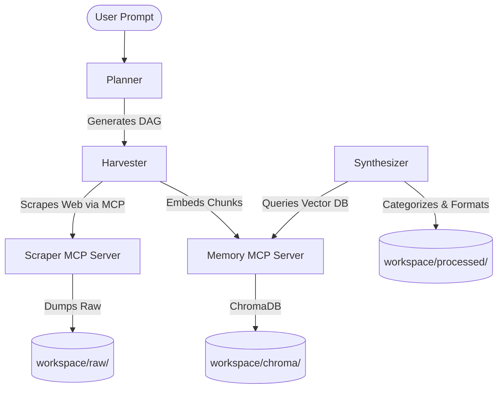

# ReseAIrch: Autonomous AI Research & Scraping Pipeline

**ReseAIrch** is a powerful multi-agent orchestration system built as the Kaggle Capstone Project for the *"5-Day AI Agents: Intensive Vibe Coding Course With Google"*. 

Designed to process everything from raw technical documentation to deep academic synthesis, ReseAIrch orchestrates specialized AI agents to securely crawl the web, store findings into a local vector memory database, and synthesize massive, categorized, full-scale markdown reports.

## Key Features (Capstone Requirements Fulfilled)
* **Multi-Agent System (ADK):** Powered by an ADK-inspired architecture consisting of three specialized roles:
  * 🧠 **Planner Agent:** Creates the Directed Acyclic Graph (DAG) for research objectives.
  * 🕷️ **Harvester Agent:** Executes the tasks, bypasses standard scrapes using `bs4`, and safely dumps raw data files.
  * ✍️ **Synthesizer Agent:** Analyzes the raw vector memory and outputs categorized, multi-file academic reports.
* **Model Context Protocol (MCP) Servers:** Implements distinct decoupled servers for `Scraping` and `ChromaDB Memory`.
* **Dynamic Formatting:** Natively capable of writing JSON-L outputs (for Model Fine-Tuning tracks) and full-scale Markdown guides (for Agents for Good tracks).
* **Versatile UIs:** Fully functional as a CLI interface or a highly-polished Glassmorphism Web App UI.

## Quick Start
Check out the [HowTO.md](HowTO.md) file for complete installation, execution, and troubleshooting steps.

## System Architecture

## License
Licensed under the **GPL 3.0** License.
